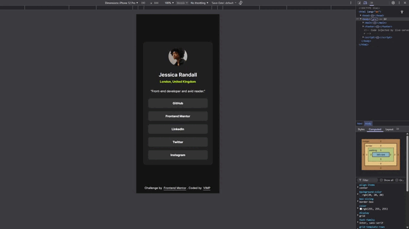

# Frontend Mentor - Social links profile solution

This is a solution to the [Social links profile challenge on Frontend Mentor](https://www.frontendmentor.io/challenges/social-links-profile-UG32l9m6dQ).  
Frontend Mentor challenges help you improve your coding skills by building realistic projects.


## 🎯 The challenge

Users should be able to:

- See hover and focus states for all interactive elements on the page
- Navigate the component using keyboard
- View the card correctly on mobile, tablet and desktop

## 📸 Preview

### 🎞️ Demo



### 📱 Mobile


### 💻 Desktop


## 🔗 Links

- [Live site URL &nearrow;](https://vimpcode.github.io/fem-social-links-profile/)

<!-- - [Solution page &nearrow;](https://your-solution-url.com) -->


## 🛠️ Built with

- Semantic HTML5 markup
- CSS custom properties
- CSS Nesting (native)
- CSS Grid
- Mobile-first workflow


## 📖 What I learned

1. __Why I used `<figure>` instead of only ``__

    ```html
    <figure>
      
    </figure>
    ```

    + `<figure>` represents self-contained content
    + Improves semantic grouping, even without a `<figcaption>`
    + Helps screen readers understand the image belongs to a specific block
    + Offers flexibility if a caption is added later
    + Not required, but improves semantic clarity

1. __The use of `<blockquote>`__

    ```html
    <blockquote>"Front-end developer and avid reader."</blockquote>
    ```

    + Even though the sentence is short, it’s a quotation from the user profile.
    + `<blockquote>` is more semantically correct than a plain `<p>`.

    To enhance typography, I added quotation marks using CSS:
    ```css
    blockquote::before {
      content: open-quote;
    }
    blockquote::after {
      content: close-quote;
    }
    ```

    __*What do `open-quote` and `close-quote` do?*__

    They insert the browser’s default typographic quotation marks, based on locale.
    + Automatic pairing of quotes
    + Proper typographic symbols
    + Better accessibility (screen readers interpret them correctly)

3. __Use of `aria-label="Social links"`__

    ```html
    <nav aria-label="Social links">
      <ul>…</ul>
    </nav>
    ```

    + Screen readers announce it as a meaningful navigation section
    + “Social links” clarifies what type of navigation it is
    + Without it, screen readers would simply say “Navigation”, which is vague

    __*Use aria-label when:*__
    + A section is meaningful but has no visible title
    + You need to clarify its purpose for assistive technologies


## 📚 Useful resources

- [MDN: `quotes` CSS property](https://developer.mozilla.org/en-US/docs/Web/CSS/quotes) - Explains how quotation marks work in CSS and how open-quote and close-quote reference the defined quote styles.


## 👤 Author

- Frontend Mentor - [@vimpcode](https://www.frontendmentor.io/profile/vimpcode)


